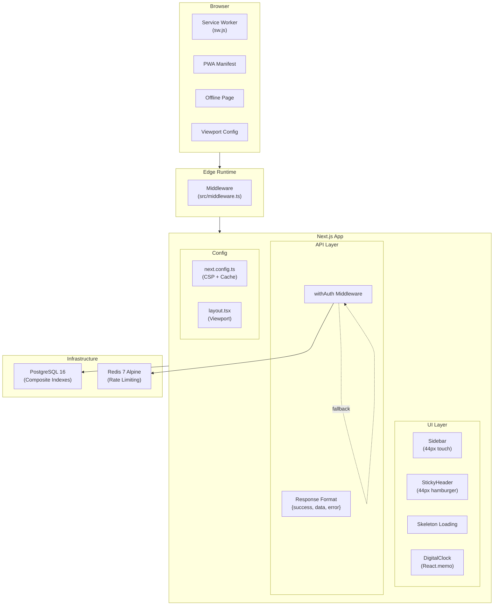
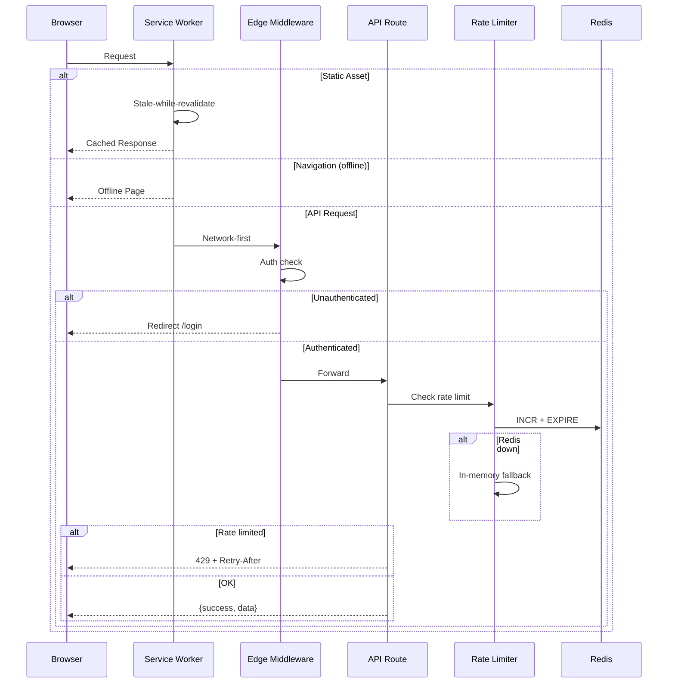

# Design Document — System Hardening

## Overview

Royal Cabana Yönetim Sistemi'nin güvenlik, erişilebilirlik, performans ve altyapı katmanlarını güçlendiren kapsamlı bir hardening paketi. Mevcut sistemin analiz skoru 7.4/10 olup, bu tasarım 17 gereksinimi kapsayarak skoru önemli ölçüde yükseltmeyi hedefler.

Değişiklikler 4 ana kategoride gruplandırılır:

1. **Security** (Req 3, 4, 8): Redis rate limiting, CSP header, Edge middleware
2. **Accessibility** (Req 1, 5, 6): Viewport zoom, touch target büyütme
3. **Performance** (Req 7, 9, 12, 15, 17): DB index, skeleton loading, cache headers, memo, font lazy load
4. **Infrastructure** (Req 2, 10, 11, 13, 14, 16): SW hardening, PWA manifest, Redis container, API format, offline page, orphan cleanup

### Tasarım Kararları

| Karar                | Seçim                          | Gerekçe                                                                         |
| -------------------- | ------------------------------ | ------------------------------------------------------------------------------- |
| Rate limiter backend | `ioredis` + in-memory fallback | Upstash gereksiz (self-hosted Redis var), ioredis sliding window desteği sağlar |
| CSP uygulaması       | `next.config.ts` headers       | Middleware'de nonce üretimi karmaşıklık ekler, static headers yeterli           |
| SW stratejisi        | Workbox-free vanilla JS        | Bundle boyutu artırmaz, mevcut SW yapısıyla uyumlu                              |
| Edge middleware      | `src/middleware.ts`            | Next.js native, edge runtime'da çalışır                                         |
| Skeleton loading     | Tailwind `animate-pulse`       | Ek kütüphane gerektirmez                                                        |

## Architecture

### Sistem Bileşen Diyagramı



### İstek Akış Diyagramı



## Components and Interfaces

### 1. Viewport Config (`src/app/layout.tsx`)

```typescript
// Mevcut → Güncel
export const viewport: Viewport = {
  themeColor: "#f59e0b",
  width: "device-width",
  initialScale: 1,
  maximumScale: 5, // 1 → 5
  userScalable: true, // false → true
  viewportFit: "cover",
};
```

### 2. Service Worker (`public/sw.js`)

```typescript
// Yeni SW yapısı
const CACHE_VERSION = "royal-cabana-v2";
const STATIC_CACHE = `static-${CACHE_VERSION}`;
const RUNTIME_CACHE = `runtime-${CACHE_VERSION}`;

const PRECACHE_URLS = [
  "/",
  "/offline.html",
  "/manifest.json",
  "/icons/Icon-192.png",
  "/icons/Icon-512.png",
];

// Install: precache critical assets + offline page
// Activate: delete old caches
// Fetch strategies:
//   - Navigation fail → offline.html
//   - Static assets → stale-while-revalidate
//   - API → network-first
//   - Other → cache-first with network fallback
```

**Interface:**

- `install` event: Precache PRECACHE_URLS
- `activate` event: Delete caches not matching CACHE_VERSION
- `fetch` event: Route-based strategy selection

### 3. Rate Limiter (`src/lib/rate-limit.ts`)

```typescript
interface RateLimitResult {
  allowed: boolean;
  retryAfter?: number; // seconds until window resets
}

// Mevcut imza korunur, internal olarak Redis kullanır
export async function rateLimit(
  key: string,
  limit?: number, // default 30
  windowMs?: number, // default 60_000
): Promise<boolean>;

// Yeni: Retry-After bilgisi döndüren versiyon
export async function rateLimitWithInfo(
  key: string,
  limit?: number,
  windowMs?: number,
): Promise<RateLimitResult>;
```

**Redis Sliding Window Algoritması:**

```
Key: `rl:{key}`
Algorithm:
  1. MULTI
  2. ZREMRANGEBYSCORE key 0 (now - windowMs)  // Eski kayıtları sil
  3. ZCARD key                                  // Mevcut sayı
  4. ZADD key now now                          // Yeni istek ekle
  5. PEXPIRE key windowMs                      // TTL ayarla
  6. EXEC
  → count < limit ? allowed : denied
```

**Fallback:** Redis bağlantı hatası → mevcut in-memory Map mekanizması

### 4. CSP Header (`next.config.ts`)

```typescript
// next.config.ts headers() içine eklenecek
{
  key: "Content-Security-Policy",
  value: [
    "default-src 'self'",
    "script-src 'self' 'unsafe-inline' 'unsafe-eval'",  // Next.js inline scripts
    "style-src 'self' 'unsafe-inline'",                   // Tailwind inline styles
    "img-src 'self' data: blob: https://royalcabana.erkanerdem.net",
    "font-src 'self'",
    "connect-src 'self' ws: wss: https://royalcabana.erkanerdem.net",
    "frame-ancestors 'none'",
    "base-uri 'self'",
    "form-action 'self'",
    "report-uri /api/csp-report",
  ].join("; ")
}
```

### 5. Sidebar Touch Targets (`src/components/shared/Sidebar.tsx`)

```typescript
// Grup alt linkleri: py-1.5 → min-h-[44px] py-2.5
// Collapsed ikon butonları: w-10 h-10 → w-11 h-11 (44px)
// Tüm tıklanabilir öğeler: minimum 44×44px
```

### 6. StickyHeader Hamburger (`src/components/shared/StickyHeader.tsx`)

```typescript
// Hamburger: w-9 h-9 → w-11 h-11 (44px)
// DigitalClock: React.memo ile sarmalanacak
const MemoizedDigitalClock = React.memo(DigitalClock);
```

### 7. Edge Middleware (`src/middleware.ts`)

```typescript
import { NextResponse } from "next/server";
import type { NextRequest } from "next/server";

const PUBLIC_ROUTES = ["/login", "/register", "/api/auth"];
const STATIC_PREFIXES = [
  "/_next/static",
  "/_next/image",
  "/favicon",
  "/icons",
  "/logo",
  "/sw.js",
  "/manifest.json",
  "/offline.html",
];

export function middleware(request: NextRequest) {
  const { pathname } = request.nextUrl;

  // Skip static files
  if (STATIC_PREFIXES.some((p) => pathname.startsWith(p))) {
    return NextResponse.next();
  }

  // Skip public routes
  if (PUBLIC_ROUTES.some((r) => pathname.startsWith(r))) {
    return NextResponse.next();
  }

  // Check auth token
  const token =
    request.cookies.get("next-auth.session-token")?.value ||
    request.cookies.get("__Secure-next-auth.session-token")?.value;

  if (!token) {
    return NextResponse.redirect(new URL("/login", request.url));
  }

  return NextResponse.next();
}

export const config = {
  matcher: [
    "/((?!_next/static|_next/image|favicon.ico|icons|logo|sw.js|manifest.json|offline.html).*)",
  ],
};
```

### 8. API Response Format (`src/lib/api-middleware.ts`)

```typescript
// withAuth hata yanıtları standartlaştırılacak:
// { error: "..." } → { success: false, error: "..." }

// Rate limit response'a Retry-After header eklenir
if (!rateLimit(key, ...)) {
  return NextResponse.json(
    { success: false, error: "Çok fazla istek. Lütfen biraz bekleyin." },
    { status: 429, headers: { 'Retry-After': String(retryAfter) } },
  );
}
```

### 9. Skeleton Loading (`src/app/(dashboard)/loading.tsx`)

```typescript
export default function DashboardLoading() {
  return (
    <div className="p-6 space-y-6 animate-pulse">
      {/* Header skeleton */}
      <div className="h-8 w-48 bg-neutral-800 rounded-lg" />
      {/* Stats row */}
      <div className="grid grid-cols-1 md:grid-cols-4 gap-4">
        {[...Array(4)].map((_, i) => (
          <div key={i} className="h-24 bg-neutral-800 rounded-xl" />
        ))}
      </div>
      {/* Content area */}
      <div className="h-64 bg-neutral-800 rounded-xl" />
    </div>
  );
}
```

### 10. Offline Page (`public/offline.html`)

Self-contained HTML dosyası:

- Inline CSS (Royal Cabana tema renkleri: `#0a0a0a` bg, `#f59e0b` amber accent)
- Logo SVG veya text fallback
- "Bağlantı kesildi" mesajı
- `navigator.onLine` event listener ile otomatik reload
- Harici kaynak bağımlılığı yok

### 11. Docker Redis Container (`docker-compose.yaml`)

```yaml
redis:
  image: redis:7-alpine
  restart: unless-stopped
  command: redis-server --maxmemory 128mb --maxmemory-policy allkeys-lru
  healthcheck:
    test: ["CMD", "redis-cli", "ping"]
    interval: 5s
    timeout: 3s
    retries: 5
  volumes:
    - redis_data:/data

# app service'e eklenir:
app:
  depends_on:
    redis:
      condition: service_healthy
  environment:
    REDIS_URL: redis://redis:6379
```

### 12. Cache-Control Headers (`next.config.ts`)

```typescript
// headers() içine eklenir:
{
  source: "/_next/static/(.*)",
  headers: [
    { key: "Cache-Control", value: "public, max-age=31536000, immutable" }
  ]
},
{
  source: "/fonts/(.*)",
  headers: [
    { key: "Cache-Control", value: "public, max-age=31536000, immutable" }
  ]
},
{
  source: "/icons/(.*)",
  headers: [
    { key: "Cache-Control", value: "public, max-age=86400" }
  ]
},
{
  source: "/logo.(png|ico)",
  headers: [
    { key: "Cache-Control", value: "public, max-age=86400" }
  ]
}
```

## Data Models

### Prisma Composite Indexes

```prisma
// Reservation modeline eklenecek:
@@index([status, deletedAt, startDate])

// Notification modeline eklenecek:
@@index([userId, isRead, createdAt])
```

Mevcut indeksler:

- `Reservation`: `@@index([status])`, `@@index([deletedAt])`, `@@index([startDate, endDate])` — ayrı ayrı var ama composite yok
- `Notification`: `@@index([userId, isRead])`, `@@index([userId, createdAt])` — ikili var ama üçlü composite yok

Composite index, sık kullanılan sorgu pattern'lerini tek index scan ile karşılar:

```sql
-- Reservation: Dashboard'da aktif rezervasyonlar
WHERE status IN ('APPROVED','CHECKED_IN') AND "deletedAt" IS NULL ORDER BY "startDate"

-- Notification: Kullanıcının okunmamış bildirimleri
WHERE "userId" = ? AND "isRead" = false ORDER BY "createdAt" DESC
```

### PWA Manifest Güncellemesi (`public/manifest.json`)

```json
{
  "id": "/",
  "name": "Royal Cabana",
  "short_name": "RCabana",
  "description": "Royal Cabana Rezervasyon Yönetim Sistemi",
  "start_url": "/",
  "display": "standalone",
  "background_color": "#0a0a0a",
  "theme_color": "#f59e0b",
  "categories": ["business", "productivity"],
  "icons": [
    { "src": "/icons/Icon-192.png", "sizes": "192x192", "type": "image/png" },
    { "src": "/icons/Icon-512.png", "sizes": "512x512", "type": "image/png" },
    {
      "src": "/icons/Icon-512.png",
      "sizes": "512x512",
      "type": "image/png",
      "purpose": "maskable"
    }
  ],
  "screenshots": [
    {
      "src": "/screenshots/dashboard.png",
      "sizes": "1280x720",
      "type": "image/png",
      "form_factor": "wide"
    },
    {
      "src": "/screenshots/mobile.png",
      "sizes": "390x844",
      "type": "image/png",
      "form_factor": "narrow"
    }
  ],
  "shortcuts": [
    {
      "name": "Rezervasyonlar",
      "url": "/reservations",
      "icons": [{ "src": "/icons/Icon-96.png", "sizes": "96x96" }]
    },
    {
      "name": "Harita",
      "url": "/map",
      "icons": [{ "src": "/icons/Icon-96.png", "sizes": "96x96" }]
    }
  ]
}
```

### Redis Veri Yapısı (Rate Limiting)

```
Key Pattern: rl:{method}:{path}:{ip}
Type: Sorted Set
Members: Unix timestamp (ms)
Score: Unix timestamp (ms)
TTL: windowMs (default 60s)

Örnek:
  Key: rl:POST:/api/reservations:192.168.1.1
  Members: [1720000001000, 1720000002000, ...]
```

### Geist Mono Font Lazy Loading

```typescript
// layout.tsx — mevcut:
const geistMono = Geist_Mono({
  variable: "--font-geist-mono",
  subsets: ["latin"],
});

// Güncel:
const geistMono = Geist_Mono({
  variable: "--font-geist-mono",
  subsets: ["latin"],
  display: "swap", // FOUT tercih edilir, FOIT yerine
});
```

## Correctness Properties

_A property is a characteristic or behavior that should hold true across all valid executions of a system — essentially, a formal statement about what the system should do. Properties serve as the bridge between human-readable specifications and machine-verifiable correctness guarantees._

### Property 1: Service Worker Caching Strategy Routing

_For any_ fetch request intercepted by the Service Worker, the applied caching strategy must match the request type: navigation failures return the offline page, static asset requests (`/_next/static/`, fonts, icons) use stale-while-revalidate, and API requests (`/api/`) use network-first.

**Validates: Requirements 2.2, 2.3, 2.4**

### Property 2: Sliding Window Rate Limiting

_For any_ sequence of requests with the same key, the rate limiter shall only count requests whose timestamps fall within the current sliding window (`now - windowMs` to `now`). Requests outside the window shall not contribute to the count, and the `allowed` result shall be `count < limit`.

**Validates: Requirements 3.3**

### Property 3: Rate Limit Retry-After Header

_For any_ request that exceeds the rate limit, the response shall include a `Retry-After` header with a positive integer value representing the number of seconds until the current window resets.

**Validates: Requirements 3.5**

### Property 4: Sidebar Touch Target Minimum Size

_For any_ clickable navigation element in the Sidebar (including sub-links and collapsed icon buttons), the rendered touch target area shall be at least 44×44 CSS pixels.

**Validates: Requirements 5.1, 5.2, 5.3**

### Property 5: Middleware Auth Enforcement

_For any_ HTTP request to a protected route (not in PUBLIC_ROUTES and not a static file) that lacks a valid session token, the Edge Middleware shall respond with a redirect to `/login`.

**Validates: Requirements 8.1, 8.2**

### Property 6: Middleware Public/Static Bypass

_For any_ HTTP request to a public route (`/login`, `/register`, `/api/auth/*`) or a static file path (`/_next/static/*`, `/favicon.ico`, `/icons/*`, `/sw.js`, `/manifest.json`, `/offline.html`), the Edge Middleware shall pass the request through without auth checks.

**Validates: Requirements 8.3, 8.4**

### Property 7: API Response Format Consistency

_For any_ API response from a `withAuth`-wrapped route, the JSON body shall contain a `success` boolean field. If the HTTP status is 2xx, the body shall also contain a `data` field. If the HTTP status is 4xx or 5xx, the body shall contain an `error` string field.

**Validates: Requirements 13.1, 13.2, 13.3**

### Property 8: Offline Page Self-Containment

_For any_ resource reference in the offline page HTML (`<link>`, `<script>`, `` tags), the `src` or `href` attribute shall not point to an external URL (no `http://` or `https://` prefixed resources). All styles and scripts shall be inline.

**Validates: Requirements 14.4**

## Error Handling

### Rate Limiter

| Senaryo                          | Davranış                                               |
| -------------------------------- | ------------------------------------------------------ |
| Redis bağlantı hatası            | In-memory Map fallback'e geç, `console.warn` ile logla |
| Redis timeout (>500ms)           | Fallback'e geç, isteği engelleme                       |
| Redis MULTI/EXEC hatası          | Fallback'e geç                                         |
| In-memory Map taşması (>10K key) | Eski entry'leri temizle                                |

### Edge Middleware

| Senaryo                  | Davranış                                |
| ------------------------ | --------------------------------------- |
| Cookie parse hatası      | Auth yok kabul et, `/login`'e yönlendir |
| Bilinmeyen route pattern | `NextResponse.next()` ile geçir         |

### Service Worker

| Senaryo                                | Davranış                                                    |
| -------------------------------------- | ----------------------------------------------------------- |
| Cache API kullanılamıyor               | Network-only modda çalış                                    |
| Precache başarısız                     | `skipWaiting()` ile devam et, sonraki ziyarette tekrar dene |
| Navigation + network fail + cache miss | Offline page göster                                         |
| API + network fail                     | Cache'den dön, cache yoksa error response                   |

### CSP

| Senaryo                | Davranış                                       |
| ---------------------- | ---------------------------------------------- |
| CSP ihlali             | `report-uri /api/csp-report` endpoint'ine POST |
| Report endpoint hatası | Sessizce logla, kullanıcıyı etkileme           |

### API Response Format

| Senaryo                    | Davranış                                                                     |
| -------------------------- | ---------------------------------------------------------------------------- |
| Handler uncaught exception | `{ success: false, error: "Sunucu hatası." }` + 500                          |
| Invalid JSON body          | `{ success: false, error: "Geçersiz istek formatı." }` + 400                 |
| Rate limited               | `{ success: false, error: "Çok fazla istek." }` + 429 + `Retry-After` header |
| Unauthorized               | `{ success: false, error: "Unauthorized" }` + 401                            |
| Forbidden                  | `{ success: false, error: "Forbidden" }` + 403                               |

## Testing Strategy

### Property-Based Testing

**Kütüphane:** `fast-check` (TypeScript/JavaScript için en olgun PBT kütüphanesi)

**Konfigürasyon:**

- Her property test minimum 100 iterasyon
- Her test, design document property numarasını referans alır
- Tag format: `Feature: system-hardening, Property {N}: {title}`

**Property Test Planı:**

| Property                   | Test Dosyası                                | Generator Stratejisi                          |
| -------------------------- | ------------------------------------------- | --------------------------------------------- |
| P1: SW Caching Strategy    | `__tests__/sw.property.test.ts`             | Random URL paths (static/api/navigation)      |
| P2: Sliding Window         | `__tests__/rate-limit.property.test.ts`     | Random timestamps, limits, window sizes       |
| P3: Retry-After            | `__tests__/rate-limit.property.test.ts`     | Random limit configs, exceed scenarios        |
| P4: Touch Targets          | `__tests__/sidebar.property.test.tsx`       | Random nav configs, collapsed/expanded states |
| P5: Middleware Auth        | `__tests__/middleware.property.test.ts`     | Random protected paths, with/without tokens   |
| P6: Middleware Bypass      | `__tests__/middleware.property.test.ts`     | Random public/static paths                    |
| P7: API Format             | `__tests__/api-middleware.property.test.ts` | Random status codes, payloads                 |
| P8: Offline Self-Contained | `__tests__/offline.property.test.ts`        | Parse HTML, check all resource refs           |

### Unit Testing

**Kütüphane:** `vitest` + `@testing-library/react`

**Unit Test Planı (spesifik örnekler ve edge case'ler):**

| Test                           | Kapsam                                                                |
| ------------------------------ | --------------------------------------------------------------------- |
| Viewport config                | `userScalable: true`, `maximumScale: 5` (Req 1.1, 1.2)                |
| SW install event               | Precache URL listesi doğruluğu (Req 2.1)                              |
| SW activate event              | Eski cache temizliği (Req 2.5, 2.6)                                   |
| Rate limiter Redis integration | Redis bağlantı, fallback (Req 3.1, 3.2)                               |
| Rate limiter signature         | Backward compat (Req 3.4)                                             |
| CSP header directives          | Her direktif kontrolü (Req 4.1–4.7)                                   |
| Hamburger button size          | 44×44px (Req 6.1, 6.2)                                                |
| Composite indexes              | Schema'da index varlığı (Req 7.1, 7.2)                                |
| Middleware matcher             | Config regex doğruluğu (Req 8.5)                                      |
| Skeleton loading               | Spinner yok, pulse var (Req 9.1, 9.3)                                 |
| PWA manifest                   | maskable icon, screenshots, categories, shortcuts, id (Req 10.1–10.5) |
| Docker compose                 | Redis service, healthcheck, depends_on, volume (Req 11.1–11.5)        |
| Cache headers                  | Static/font/icon header values (Req 12.1–12.3)                        |
| Offline page                   | Mesaj, auto-reload, no external deps (Req 14.1, 14.3)                 |
| DigitalClock memo              | React.memo wrapper (Req 15.1)                                         |
| Font config                    | display: 'swap' (Req 17.1)                                            |

### Test Çalıştırma

```bash
# Unit tests
npx vitest --run

# Property tests (100+ iterations)
npx vitest --run __tests__/*.property.test.*
```
